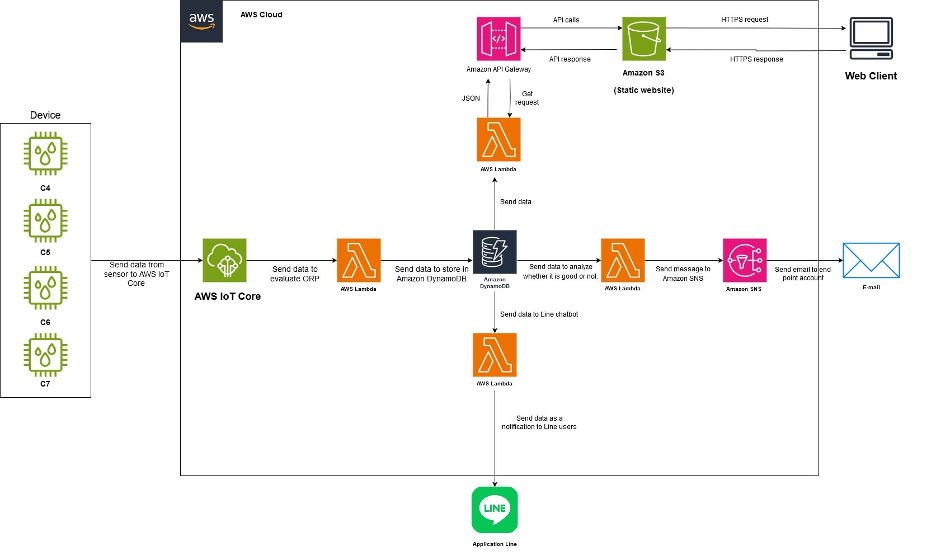

### AquaGuard

The AquaGuard Project was developed using Internet of Things (IoT) technology in conjunction with cloud computing to create a system capable of monitoring and safeguarding water quality. The system employs sensors to measure key indicators of water quality, including Oxidation-Reduction Potential (ORP), temperature, and pH level. These measurements are essential for assessing water conditions.

The collected data is stored in AWS DynamoDB, enabling processing, analysis, and presentation of the information.

Data gathered from IoT devices is analyzed to issue alerts to dormitory management promptly if abnormal values or values exceeding standard thresholds are detected. The system sends notifications to both the dormitory administrators and residents, allowing them to take immediate action to resolve issues and maintain water quality within the dormitory effectively.

### Diagram

### AWS services: 

1. **AWS IoT Core**  
   - Receives data from sensors and forwards it to **AWS Lambda**.

2. **Amazon S3**  
   - Used for hosting the web application as a **static website**.

3. **Amazon API Gateway**  
   - Acts as an API for accessing data. When users access the website, they call the API through **Amazon API Gateway**.

4. **AWS Lambda (connected to Amazon API Gateway and Amazon DynamoDB)**  
   - Fetches data from **Amazon DynamoDB**, triggers AWS Lambda, and sends the data to the website for display.

5. **AWS Lambda (used for water quality inspection)**  
   - Fetches data from **Amazon DynamoDB** and evaluates the water quality as either **GOOD** or **BAD**.  
   - If the water quality is **BAD**, a message is sent to **Amazon SNS** for further action.

   

6. **AWS Lambda (Line chatbot)**  
   - Retrieves data from **Amazon DynamoDB** and sends water quality information as a message to the **Line application**.
   
    

7. **AWS DynamoDB**  
   - A **NoSQL database** for storing sensor data such as ORP, pH, and temperature.  
   - Maintains data history and organizes it for efficient access by **AWS Lambda** and **Amazon API Gateway**.  
   - Stored data can be used for retrospective analysis to observe water quality trends and system performance.

8. **Amazon SNS**  
   - Receives messages from **AWS Lambda** (used for water quality inspection) and sends them to the destination email.

### Line OA Chatbot

---
